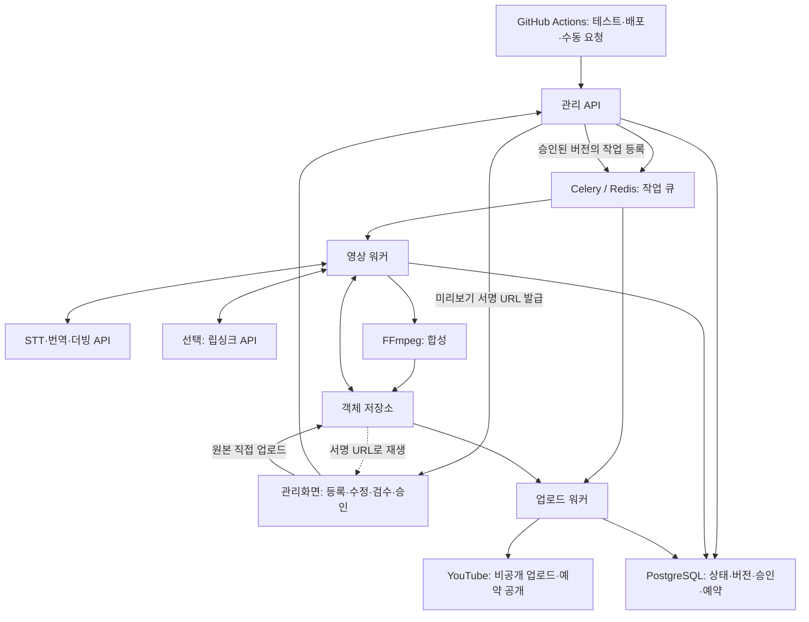

# 시스템 설계

이 문서는 구현 전 제안입니다.

## 구성

GitHub Actions는 배포와 작업 요청을 담당합니다. 실제 작업 실행 상태는 DB가 관리하며 장시간 영상 처리는 별도 워커가 담당합니다. 브라우저에는 AI API 키나 YouTube 토큰을 전달하지 않습니다.

## 처리 단계

1. 로그인한 관리자가 업로드 권한을 요청합니다. 짧은 유효기간의 서명 URL로 원본을 저장소에 직접 올립니다.
2. API가 파일 존재·크기·체크섬을 확인하고 워커가 ffprobe로 형식과 길이를 검사합니다. 큰 파일은 분할 업로드합니다.
3. 오디오를 추출하고 STT를 수행합니다. 문장별 시간과 지원되는 경우 화자를 기록합니다.
4. 문맥과 용어집을 사용해 번역하고 관리자가 수정할 수 있도록 저장합니다.
5. 문장별 음성을 만들고 실제 길이를 측정합니다. 허용 범위 안에서 길이를 조정하고 차이가 큰 구간은 번역 수정·재생성 대상으로 표시합니다.
6. 배경음 트랙을 합성합니다. 별도 트랙이 없으면 음원 분리 품질 검증이 필요합니다. 원음 전체를 그대로 섞지 않습니다. 원래 대사가 더빙 음성과 중복되지 않도록 대사를 제거한 배경음만 사용합니다.
7. 선택적으로 립싱크를 수행한 뒤 최종 음성·영상·자막을 합성합니다. 자막 시간은 최종 음성 타이밍에 맞춥니다.
8. 결과물을 검수하고 정확한 버전을 승인합니다.
9. 승인된 파일을 비공개 업로드하고 YouTube 처리 상태를 확인한 뒤 공개 예약을 설정·확인합니다.

### 더빙 길이 정합

번역한 문장의 음성 길이는 원본 구간과 일치하지 않습니다. 구간이 밀리면 뒤 구간과 겹치고 자막도 어긋나므로 조정 규칙을 고정합니다.

- 겹침 금지 조건: 조정 후 음성 종료 시각이 다음 구간의 시작 시각을 넘지 않아야 합니다. 이 조건이 모든 경우의 상한이며 허용 오차보다 우선합니다.
- 사용 가능한 길이는 구간 길이에 구간 뒤 무음 길이를 더한 값입니다. 마지막 구간은 영상 끝 시각을 상한으로 둡니다.
- 허용 오차: 음성 길이가 원본 구간 대비 ±10% 이내이고 위 상한을 지키면 그대로 사용합니다. 오차가 ±10% 이내여도 다음 구간을 침범하면 조정 대상입니다.
- 조정 순서: 구간 뒤 무음을 흡수합니다. 부족하면 재생 속도를 조절합니다. 그래도 부족하면 번역을 축약해 재생성합니다. 마지막으로 검수 대상으로 표시합니다.
- 속도 조절 범위는 0.9~1.15배를 제안합니다. 이 범위를 넘겨야 맞출 수 있으면 조절하지 않고 축약 재생성으로 넘깁니다.
- 축약 재생성은 세그먼트별 시도 횟수를 제한하고 시도마다 비용을 기록합니다.
- 앞 구간의 초과분을 뒤 구간 시작 시각을 밀어 흡수하지 않습니다. 화면과 음성의 어긋남이 누적됩니다.
- 조정 후에도 허용 오차를 넘는 구간이 남으면 작업을 실패로 처리하지 않고 해당 구간 목록과 함께 `review_required`로 보냅니다.
- 자막 시간은 조정이 끝난 최종 음성 타이밍으로 다시 계산합니다.
- 합성 직전에 전체 구간의 겹침을 다시 검사합니다. 겹치는 구간이 하나라도 남으면 합성하지 않고 `review_required`로 보냅니다.

허용 오차, 속도 범위, 재생성 횟수는 제안값입니다. 대표 영상 측정 후 확정하고 그 결과를 이 문서에 반영합니다.

## 데이터 모델 초안

| 엔터티 | 주요 정보 |
|---|---|
| source_assets | 파일 키, 체크섬, 길이, 해상도, 원본 언어 |
| jobs | 원본 ID, 대상 언어, 설정 버전, 현재 단계, 상태 |
| stage_runs | 단계, 입력 해시, 시도 번호, 공급자 작업 ID, 시작·종료, 오류, 비용 |
| transcript_segments | 원본 ID, 화자, 시작·종료, 원문, 생성한 STT 단계 실행 ID |
| translated_segments | 작업 ID, 원문 세그먼트 ID, 번역문, 편집 버전, 더빙 음성 키 |
| glossaries | 적용 범위, 언어쌍, 버전, 항목, 적용 시작 시각 |
| voice_assignments | 작업 ID, 화자 ID, 공급자 음성 ID, 음성 설정, 버전 |
| budgets | 적용 범위(월·작업), 통화, 한도, 기간, 누적 사용액 |
| budget_reservations | 예산 ID, 단계 실행 ID, 예약 금액, 상태, 만료 시각 |
| artifacts | 작업 ID, 종류, 버전, 저장소 키, 체크섬, 생성 설정 |
| approvals | 결과물 ID, 승인자, 승인 시각, 승인 대상 메타데이터 버전 |
| publications | 승인 ID, 채널 ID, 업로드 세션, YouTube 영상 ID, 예약 UTC, 게시 상태, 대체한 게시 ID |

테이블명과 API 경로는 구현 시 확정합니다. 대본이나 음성 변경은 후속 산출물을 새 버전으로 만들고 과거 승인과 분리합니다.

원문 세그먼트는 원본에, 번역 세그먼트는 작업에 소속시킵니다. 언어를 추가할 때는 동일 원본의 원문 세그먼트를 그대로 참조하고 번역 세그먼트만 새 작업으로 생성합니다. 원문을 언어별로 복제하지 않으므로 STT 재사용과 원문 수정의 단일 기준이 유지됩니다.

용어집은 번역 단계의 입력이고 음성 배정은 더빙 단계의 입력입니다. 두 항목의 버전은 아래 재실행 판정의 입력 해시에 포함합니다. 화자를 구분하지 않는 작업도 기본 화자 하나로 음성 배정을 만들어 같은 경로로 처리합니다.

## 상태와 복구

영상 제작 상태: `queued / processing / blocked / review_required / approved / rejected / failed / cancelled`.

게시 상태: `pending / uploading / processing_on_youtube / scheduled / published / superseded / failed / cancelled`.

전이는 아래를 제안합니다.

| 현재 상태 | 이벤트 | 다음 상태 |
|---|---|---|
| queued | 워커가 단계 실행을 시작 | processing |
| processing | 제작 단계를 모두 완료 | review_required |
| processing | 재시도 한도까지 실패 | failed |
| processing | 관리자가 취소 | cancelled |
| processing | 비용 한도 초과로 호출 중단 | blocked |
| blocked | 한도 상향 또는 작업 범위 축소 | processing |
| blocked | 관리자가 취소 | cancelled |
| review_required | 승인 | approved |
| review_required | 반려(사유 기록) | rejected |
| rejected | 대본·설정 수정 후 재실행 | queued |
| failed | 실패 단계부터 재실행 | processing |
| approved | 승인 이후 수정으로 새 버전 생성 | review_required |

게시는 승인된 버전에 대해 `pending`으로 시작하고, 업로드나 예약 설정이 확정적으로 실패하면 `failed`, 관리자가 예약을 취소하면 `cancelled`, 새 게시로 교체되면 `superseded`로 둡니다. 결과가 불명확한 상태는 실패로 단정하지 않고 기존 업로드 세션·영상 ID를 조회해 판정합니다.

단계 실행은 `pending / running / succeeded / failed / cancelled`를 별도로 관리합니다. 실패 단계·마지막 성공 산출물·오류 이유를 보존합니다. 수정 요청은 새 버전을 생성하며 새 버전은 다시 `review_required`가 됩니다.

- DB를 상태의 기준으로 사용하고 큐에는 작업 식별자만 넣습니다.
- DB에 실행 요청을 기록하는 트랜잭션과 outbox 전달 방식을 사용해 큐 전송 실패에 대비합니다. 누락·장기 정체 작업을 주기적으로 재조정합니다.
- 작업·단계·입력 버전 조합에 중복 방지 키를 두고 실행 잠금과 heartbeat로 중복 워커 및 중단을 감지합니다.
- 동일한 요청은 성공 산출물을 재사용합니다. 외부 유료 호출은 공급자 작업 ID를 기록하고 재호출 전에 상태를 조회합니다.
- 일시적 오류는 제한된 지수 백오프로 재시도하고 인증·입력 오류는 수정이 필요하다고 표시합니다.
- 장시간 단계를 Celery 태스크 하나로 실행하지 않습니다. 외부 API 단계는 제출·상태 조회·수거를 짧은 태스크로 나누고 진행 상태는 DB가 보유합니다. 재전달이 일어나도 공급자 작업 ID로 이어받습니다.
- FFmpeg 합성처럼 나눌 수 없는 자체 처리는 별도 큐에서 실행하고 태스크는 하위 프로세스를 감시만 합니다. heartbeat로 진행 중임을 갱신하고 Redis 재전달 시간과 Celery 작업 제한은 최장 실행 시간보다 길게 설정한 뒤 장애 테스트로 확인합니다.
- 태스크는 늦은 확인(acks_late)을 사용하고 중복 방지 키와 실행 잠금으로 재전달 시 중복 실행을 막습니다.
- YouTube 업로드 세션과 영상 ID를 보존합니다. 결과가 불명확하면 기존 세션을 확인하며 무조건 새 업로드를 시작하지 않습니다.
- 승인 버전·채널별 게시 요청에 유일성 제약을 둡니다. 외부 API 호출의 정확히 한 번 실행을 보장한다고 가정하지 않습니다.
- 예약 성공은 API 응답 및 조회 결과로 확인하고 실제 공개 여부도 별도로 확인합니다.

### 재실행 판정

`stage_runs.입력 해시`는 같은 요청인지 판단하는 유일한 기준입니다. 다음을 모두 포함합니다.

- 단계 종류와 입력 산출물의 체크섬.
- 공급자, 모델 ID, 모델 버전, 음성 ID, 언어 설정.
- 단계 파라미터, 프롬프트 템플릿 버전, 용어집 버전.
- 단계 로직의 계약 버전.

해시가 같고 상태가 `succeeded`인 실행이 있으면 산출물을 재사용하고 유료 호출을 하지 않습니다. `jobs.설정 버전`이 바뀌면 그 설정을 입력으로 쓰는 단계만 해시가 달라집니다. 음성을 바꾸면 더빙과 합성은 다시 실행하고 STT·번역은 재사용합니다. 공급자가 모델 버전을 공개하지 않으면 그 단계는 재사용 대상에서 제외하거나 수동으로 캐시를 무효화합니다.

### 비용 한도

- `budgets`에 월 한도와 작업당 한도를 둡니다. 유료 호출 전에 단계 비용을 추정합니다.
- 누적액 확인만으로는 여러 워커가 같은 잔액을 동시에 사용할 수 있습니다. 호출 전에 예상 비용을 `budget_reservations`에 예약하고, 잔액 확인과 예약을 한 트랜잭션에서 수행하며 해당 예산 행을 잠급니다. 잔액은 누적 사용액과 예약 합계를 함께 뺀 값입니다.
- 예약에 실패하면 호출하지 않고 작업을 `blocked`로 둡니다. 사람이 한도를 올리거나 작업을 취소해야 진행됩니다.
- 호출이 끝나면 실제 비용으로 정산하고 예약을 해제합니다. 실패·취소도 예약을 해제합니다. 정산은 누적 사용액 갱신과 같은 트랜잭션에서 수행합니다.
- 예상 비용을 알 수 없는 호출은 상한값으로 예약하고 정산에서 차액을 되돌립니다.
- 워커가 중단되어 정산되지 않은 예약은 만료 시각을 두고 회수합니다. 회수 전에 공급자 작업 ID로 실제 실행 여부를 확인하고, 실행된 호출은 실제 비용으로 정산합니다.
- 재시도와 축약 재생성은 각각 횟수 상한을 두고, 같은 작업의 누적 유료 호출 비용이 작업 한도를 넘으면 자동 재시도를 중단합니다.
- 추정 비용과 실제 비용을 모두 `stage_runs`에 기록하고 차이를 확인합니다. 공급자 요금은 바뀌므로 단가는 설정으로 둡니다.
- 한도 금액은 사용자 확정 대상입니다. 확정 전에는 모든 유료 호출을 수동 승인으로 둡니다.

### 게시 후 수정

업로드된 영상은 파일만 교체할 수 없습니다. `videos.update`로 바꿀 수 있는 범위는 계정 준비 단계에서 공식 문서로 확인하고, 파일이 바뀌는 수정은 아래 경로로 처리합니다.

- 제목·설명·공개 시각만 바뀌면 새로 업로드하지 않고 기존 영상의 메타데이터를 수정합니다. 승인 대상 메타데이터 버전을 갱신합니다.
- 영상이나 음성이 바뀌면 새 결과물 버전을 만들어 다시 승인받고 새 publication으로 비공개 업로드·예약을 수행합니다.
- 이전 영상이 아직 공개 전이면 새 게시의 예약을 조회로 확인한 뒤 이전 예약을 취소하고 이전 publication을 `superseded`로 둡니다.
- 이전 영상이 이미 공개 중이면 예약 확인만으로 전환하지 않습니다. 새 영상이 실제로 공개된 것을 조회로 확인한 뒤 이전 영상을 비공개로 전환합니다. 예약 시각 전에 전환하면 두 영상 모두 공개되지 않는 공백이 생깁니다.
- 이 순서에서는 두 영상이 잠시 함께 공개됩니다. 공백보다 중복 공개를 택한 것이며, 즉시 전환이 필요하면 새 영상을 예약이 아니라 즉시 공개로 게시한 뒤 전환합니다.
- 이전 영상은 삭제하지 않고 비공개로 둡니다. 삭제는 사용자 지시가 있을 때만 수행합니다.
- `publications.대체한 게시 ID`로 교체 이력을 추적합니다.
- 공개된 영상을 교체하면 조회수와 링크가 끊깁니다. 검수 단계에서 걸러내는 것을 우선합니다.

## 배포·운영

초기에는 Linux 서버의 Docker Compose로 관리 API, 프런트엔드, Redis, 워커를 실행하는 구성을 제안합니다. PostgreSQL은 관리형 또는 백업 가능한 별도 볼륨을 사용합니다. 객체 저장소는 외부 서비스입니다. 립싱크 API 사용 시 자체 GPU는 필수가 아닙니다.

CPU 합성 작업과 업로드 작업은 큐·동시 실행 수를 분리합니다. FFmpeg는 별도 프로세스에서 실행하고 파일 크기·길이 제한, 타임아웃, 임시 디스크 사용량을 관리합니다. 서버 사양은 대표 영상 측정 후 결정합니다.

인증된 관리자만 파일과 미리보기에 접근하도록 하고 저장소는 비공개로 둡니다. 미리보기와 다운로드 URL은 API가 권한을 확인한 뒤 짧은 유효기간의 서명 URL로 발급합니다. 브라우저가 저장소에서 직접 내려받더라도 URL 발급 경로는 API 하나로 둡니다. API 비밀과 OAuth 갱신 토큰은 서버 비밀 저장소에 보관합니다. 로그에는 작업 ID를 포함하되 토큰·서명 URL·전체 대본을 기본 출력하지 않습니다. 작업 시간·실패율·비용·디스크 사용량을 기록하고 DB 백업 복구를 검증합니다.

### 보존과 삭제

- 원본, 중간 산출물, 완성 영상, 대본의 보관 기간을 각각 정합니다. 기간은 사용자 확정 대상입니다.
- 중간 산출물은 작업 완료 후 짧게 두고 완성 영상과 승인 이력은 길게 두는 것을 제안합니다.
- 원본 삭제 요청은 그 원본에서 파생된 대본, 번역, 음성, 합성 결과까지 함께 삭제합니다. 파생 관계는 `source_assets` → `transcript_segments` → 작업 → 결과물로 추적합니다.
- 승인·게시 이력은 감사 목적으로 남기되 대본 본문과 파일은 삭제하고 삭제 사실과 시각을 기록합니다.
- 게시된 영상은 자동으로 삭제하지 않습니다. 사용자 지시에 따라 비공개 전환 또는 삭제를 수행합니다.
- 대본에는 개인정보가 포함될 수 있습니다. 로그에 전체 대본을 출력하지 않는 규칙과 함께 적용합니다.
