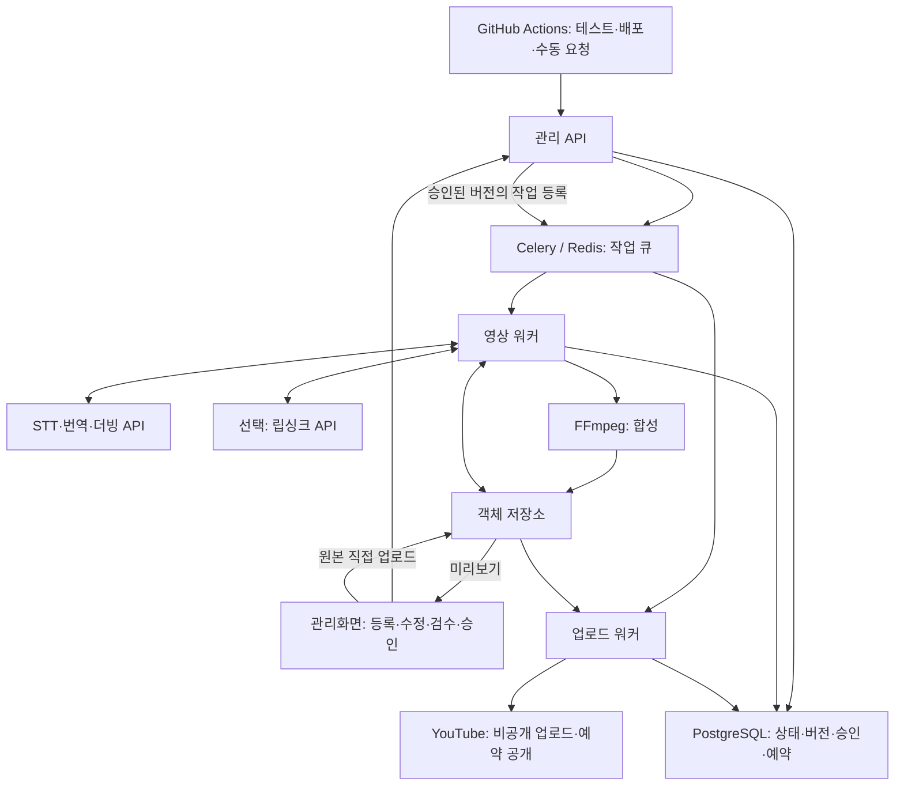

# 시스템 설계

이 문서는 구현 전 제안입니다.

## 구성

GitHub Actions는 배포와 작업 요청을 담당합니다. 실제 작업 실행 상태는 DB가 관리하며 장시간 영상 처리는 별도 워커가 담당합니다. 브라우저에는 AI API 키나 YouTube 토큰을 전달하지 않습니다.

## 처리 단계

1. 로그인한 관리자가 업로드 권한을 요청합니다. 짧은 유효기간의 서명 URL로 원본을 저장소에 직접 올립니다.
2. API가 파일 존재·크기·체크섬을 확인하고 워커가 ffprobe로 형식과 길이를 검사합니다. 큰 파일은 분할 업로드합니다.
3. 오디오를 추출하고 STT를 수행합니다. 문장별 시간과 지원되는 경우 화자를 기록합니다.
4. 문맥과 용어집을 사용해 번역하고 관리자가 수정할 수 있도록 저장합니다.
5. 문장별 음성을 만들고 실제 길이를 측정합니다. 허용 범위 안에서 길이를 조정하고 차이가 큰 구간은 번역 수정·재생성 대상으로 표시합니다.
6. 배경음 트랙을 합성합니다. 별도 트랙이 없으면 음원 분리 품질 검증이 필요합니다. 원음 전체를 그대로 섞어 원래 대사가 중복되지 않도록 합니다.
7. 선택적으로 립싱크를 수행한 뒤 최종 음성·영상·자막을 합성합니다. 자막 시간은 최종 음성 타이밍에 맞춥니다.
8. 결과물을 검수하고 정확한 버전을 승인합니다.
9. 승인된 파일을 비공개 업로드하고 YouTube 처리 상태를 확인한 뒤 공개 예약을 설정·확인합니다.

## 데이터 모델 초안

| 엔터티 | 주요 정보 |
|---|---|
| source_assets | 파일 키, 체크섬, 길이, 해상도, 원본 언어 |
| jobs | 원본 ID, 대상 언어, 설정 버전, 현재 단계, 상태 |
| stage_runs | 단계, 입력 해시, 시도 번호, 공급자 작업 ID, 시작·종료, 오류, 비용 |
| segments | 화자, 시작·종료, 원문, 번역문, 편집 버전 |
| artifacts | 작업 ID, 종류, 버전, 저장소 키, 체크섬, 생성 설정 |
| approvals | 결과물 ID, 승인자, 승인 시각, 승인 대상 메타데이터 버전 |
| publications | 승인 ID, 채널 ID, 업로드 세션, YouTube 영상 ID, 예약 UTC, 게시 상태 |

테이블명과 API 경로는 구현 시 확정합니다. 대본이나 음성 변경은 후속 산출물을 새 버전으로 만들고 과거 승인과 분리합니다. 언어를 추가할 때는 동일 원본·STT를 재사용하고 별도 작업을 생성합니다.

## 상태와 복구

영상 제작 상태: `queued → processing → review_required → approved`.

게시 상태: `pending → uploading → processing_on_youtube → scheduled → published`.

단계 실행은 `pending / running / succeeded / failed / cancelled`를 별도로 관리합니다. 실패 단계·마지막 성공 산출물·오류 이유를 보존합니다. 수정 요청은 새 버전을 생성하며 새 버전은 다시 `review_required`가 됩니다.

- DB를 상태의 기준으로 사용하고 큐에는 작업 식별자만 넣습니다.
- DB에 실행 요청을 기록하는 트랜잭션과 outbox 전달 방식을 사용해 큐 전송 실패에 대비합니다. 누락·장기 정체 작업을 주기적으로 재조정합니다.
- 작업·단계·입력 버전 조합에 중복 방지 키를 두고 실행 잠금과 heartbeat로 중복 워커 및 중단을 감지합니다.
- 동일한 요청은 성공 산출물을 재사용합니다. 외부 유료 호출은 공급자 작업 ID를 기록하고 재호출 전에 상태를 조회합니다.
- 일시적 오류는 제한된 지수 백오프로 재시도하고 인증·입력 오류는 수정이 필요하다고 표시합니다.
- Redis 재전달 시간과 Celery 작업 제한은 최장 단계 실행 시간에 맞춰 설정하고 장애 테스트로 확인합니다.
- YouTube 업로드 세션과 영상 ID를 보존합니다. 결과가 불명확하면 기존 세션을 확인하며 무조건 새 업로드를 시작하지 않습니다.
- 승인 버전·채널별 게시 요청에 유일성 제약을 둡니다. 외부 API 호출의 정확히 한 번 실행을 보장한다고 가정하지 않습니다.
- 예약 성공은 API 응답 및 조회 결과로 확인하고 실제 공개 여부도 별도로 확인합니다.

## 배포·운영

초기에는 Linux 서버의 Docker Compose로 관리 API, 프런트엔드, Redis, 워커를 실행하는 구성을 제안합니다. PostgreSQL은 관리형 또는 백업 가능한 별도 볼륨을 사용합니다. 객체 저장소는 외부 서비스입니다. 립싱크 API 사용 시 자체 GPU는 필수가 아닙니다.

CPU 합성 작업과 업로드 작업은 큐·동시 실행 수를 분리합니다. FFmpeg는 별도 프로세스에서 실행하고 파일 크기·길이 제한, 타임아웃, 임시 디스크 사용량을 관리합니다. 서버 사양은 대표 영상 측정 후 결정합니다.

인증된 관리자만 파일과 미리보기에 접근하도록 하고 저장소는 비공개로 둡니다. API 비밀과 OAuth 갱신 토큰은 서버 비밀 저장소에 보관합니다. 로그에는 작업 ID를 포함하되 토큰·서명 URL·전체 대본을 기본 출력하지 않습니다. 작업 시간·실패율·비용·디스크 사용량을 기록하고 DB 백업 복구를 검증합니다.
