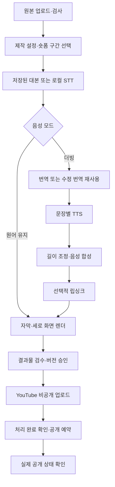

# 단계별 제작·게시 연결

## 구현 흐름



GitHub는 소스와 CI를 관리합니다. 장시간 영상 처리는 별도 Celery 워커가 수행합니다. 관리 API와 PostgreSQL이 설정·단계 결과·승인·업로드 세션을 보관하고 Redis에는 작업 ID만 전달합니다. 영상 파일은 S3에 둡니다.

## 화면에서 사용하는 순서

1. 원본을 등록하고 `verified` 검사가 끝날 때까지 기다립니다.
2. 롱폼 전체 제작은 **단계별 영상 제작·게시** 양식에서 원본을 선택합니다. 숏폼은 편집기에서 구간·크롭·자막을 정한 뒤 **선택 구간을 번역·더빙 단계로 보내기**를 누릅니다.
3. 원어 유지 또는 번역·더빙을 선택합니다. 더빙은 음성 ID, 작업 예산, 월 공통 예산이 필요합니다. 립싱크는 선택 사항입니다.
4. 작업별 단계와 중단 사유를 확인합니다. 설정·예산 부족은 수정 후 재개합니다. 번역이 너무 길면 번역 검수에서 줄여 **새 버전**을 제작합니다.
5. 최종 영상을 재생해 확인하고 그 결과물 버전을 승인합니다.
   - 작업 화면의 **자막 SRT·VTT 내려받기**로 그 작업의 자막을 파일로 받습니다. 영상에 구운 자막과 같고, 더빙 작업은 합성 음성에 맞춰 재정렬한 번역 자막이 나옵니다.
6. 제목·설명·아동용 여부·한국 시간 예약 시각을 입력합니다. 비공개 업로드 후 YouTube 처리 완료를 확인하여 예약합니다. 처리 중에는 자동으로 다시 조회합니다.
7. 예약 시각이 지나 실패했다면 게시 목록의 예약 시각 수정으로 기존 영상/세션을 유지하여 다시 예약합니다. 종료된 게시물을 새로 업로드하지 않습니다.

원어 경로는 번역을 하지 않습니다. 더빙 경로는 원래 음성을 통째로 교체하므로 배경음 보존·음원 분리는 아직 없습니다. 최대 15% 속도 조정으로 다음 대사 시작 전까지 음성을 맞추며, 이 범위를 넘으면 대본 수정을 요청합니다. 이 수치는 초기 구현 기준이며 실제 음질 평가는 별도입니다. 자막 종료는 합성된 음성 길이에 맞춥니다.

## 서버 연결 순서

1. [개발 환경](DEVELOPMENT.md)에 따라 DB·Redis·S3·API·워커·디스패처를 준비하고 `alembic upgrade head`로 `0003_workflow`까지 적용합니다. 의존성은 `pip install -e '.[dev,analysis,providers]'`입니다. 워커에는 FFmpeg와 한국어 글꼴이 필요합니다.
2. `.env.example`을 참고해 실제 값을 커밋하지 않는 `.env`에 넣습니다. Compose 2.24 이상은 API·워커에 루트 `.env`를 전달합니다. 컨테이너 내부 DB/Redis/개발 S3 주소는 compose의 값이 우선합니다. 외부 S3를 쓸 경우 compose override의 해당 주소도 변경합니다.
3. Google Cloud 프로젝트 및 Application Default Credentials, ElevenLabs 키·음성 ID를 준비합니다. 립싱크를 쓰면 Sync 키와 공급자가 접근 가능한 HTTPS 저장소가 필요합니다. localhost MinIO 주소는 외부 공급자가 접근할 수 없습니다.
4. 공급자 계약에 맞춘 **보수적인 USD 단가 상한**을 지정합니다. `R4_TRANSLATE_USD_PER_1K_CHARS`, `R4_TTS_USD_PER_1K_CHARS`, `R4_LIPSYNC_USD_PER_SECOND`입니다. 실제 청구액을 자동 조회하는 기능은 없습니다. 유료 처리 준비 후 `R4_PAID_PROCESSING_ENABLED=true`를 설정하고 API·워커를 재시작합니다.
5. YouTube는 사용자가 직접 로컬에서 아래 로그인 명령을 실행합니다. Desktop OAuth 클라이언트 JSON이 필요합니다. 토큰 파일은 저장소 밖에 두며 기존 파일을 덮어쓰지 않습니다.

```bash
export PYTHONPATH=packages/pipeline:services/api:services/worker
python -m worker.connect_youtube /private/path/client-secret.json /private/path/youtube-token.json
```

6. 표시된 채널 ID를 `R4_YOUTUBE_CHANNEL_ID`, 토큰 경로를 `R4_YOUTUBE_CREDENTIALS_FILE`에 지정합니다. 준비 후 `R4_YOUTUBE_UPLOAD_ENABLED=true`를 설정합니다. OAuth 계정 채널과 게시 요청 채널이 일치해야 실행합니다. API·워커에 동일한 채널 설정을 적용합니다.
7. Docker에서는 자격증명 파일이 자동 전달되지 않습니다. 커밋하지 않는 compose override로 읽기 전용 마운트를 추가하고, 컨테이너의 UID 10001이 읽을 수 있도록 호스트 파일 권한을 설정합니다. 경로는 호스트 경로가 아닌 컨테이너 경로를 환경 변수에 지정합니다.

```yaml
services:
  worker:
    volumes:
      - /private/path/youtube-token.json:/run/secrets/youtube-token.json:ro
      - /private/path/google-adc.json:/run/secrets/google-adc.json:ro
```

이번 구현에서는 실제 공급자 계정 연결·유료 실행·YouTube 업로드를 수행하지 않았습니다. 설치 후 실제 계정으로 비공개 샘플을 검증해야 합니다.

## 재시도와 복구

- `job.start`와 `job.step`은 같은 제작 워커로 전달됩니다. 한 메시지는 한 단계만 수행하고 다음 요청을 DB outbox에 저장합니다. 결과와 다음 요청은 함께 커밋합니다.
- 실행 점유는 2시간, 태스크 강제 종료는 1시간입니다. 살아 있는 점유가 있으면 두 번째 워커는 실행하지 않습니다. 워커가 죽으면 점유 만료 후 재개 API로 복구할 수 있습니다. 화면의 작업 재개 버튼 또는 `POST /jobs/{id}/resume`을 사용합니다. 살아 있는 점유 중에는 재개가 거절됩니다.
- 유료 요청 전 작업 예산과 월 공통 예산을 함께 예약합니다. 성공 시 설정한 비용 상한을 사용액으로 정산합니다. 불명확한 요청은 예약을 유지합니다. 실제 비용 대사는 운영자가 별도로 수행해야 합니다.
- 원격 요청 결과가 유실되면 자동 재호출하지 않습니다. 화면에서 공급자 내역 확인 근거를 기록하고 미실행 확인 또는 청구 상한 정산 후 재개합니다. 실행되었으나 결과를 찾지 못한 경우 재실행에 추가 비용이 들 수 있습니다.
- 립싱크의 원격 ID가 저장되었다면 새로 제출하지 않고 같은 작업을 조회합니다. 공급자의 종료 실패는 단계 정산 화면에서 미청구 확인·예약 해제 또는 청구 확인·상한 정산 후 새 립싱크 시도로 재개합니다. 이전 TTS와 합성 파일을 재사용하며 자동 무한 재제출하지 않습니다.
- 업로드 세션 URL은 서버 DB에만 저장합니다. 이미 저장한 video ID 또는 세션을 재사용합니다. 세션 생성 응답까지 유실된 경우 자동 재개를 막습니다. 채널 확인 후 운영자 복구가 필요하며 초기화 버튼은 제공하지 않습니다.
- 승인 없는 결과물·체크섬이 달라진 파일은 업로드할 수 없습니다. 승인 버전+채널의 유일성으로 중복 요청을 묶습니다. 예약 메타데이터가 다르면 새 업로드 대신 충돌을 반환합니다.

## 코드 위치와 검증

- 공통 설정: `pipeline/workflow.py`
- API: `adminapi/routers/workflow.py`, `jobs.py`, `editing.py`
- 제작: `worker/workflow_tasks.py`, 실제 FFmpeg 합성: `worker/composition.py`
- 게시: `worker/publication_tasks.py`, `worker/youtube.py`, `worker/connect_youtube.py`
- 화면: `WorkflowPanel.tsx`, `PublicationForm.tsx`, `ClipEditor.tsx`
- 테스트: `tests/test_connected_workflow.py`와 기존 어댑터·편집·예산 테스트

로컬 검증: Python 146개 통과, PostgreSQL 전용 경합 1개 건너뜀. 실제 FFmpeg 합성·디코딩·무음 구간·자막 검증, SQLite 마이그레이션 왕복, 린트·포맷, TypeScript·Vite 빌드, 브라우저 작업 생성→검수 필요 상태 확인을 수행했습니다. DB·공급자·저장소는 테스트 대역을 사용한 부분이 있으며, 실제 STT 모델 추론·공급자·OAuth·S3·Compose 전체 기동은 별도 검증 대상입니다.


### 번역 수정 시 음성 재사용

화면의 **수정 문장만 다시 더빙해 새 버전 제작**은 기존 작업 ID를 명시하여 변경되지 않은 음성 파일을 재사용합니다. 변경 문장만 신규 호출합니다. 공급자 모델의 리비전이 공개되지 않아도 기존 파일 자체를 선택하는 방식이며, 임의 작업 간 자동 캐시는 사용하지 않습니다. `R4_TTS_MODEL_VERSION`과 `R4_TTS_VOICE_VERSION`이 확인된 경우에만 그 버전에 한정한 자동 캐시를 사용할 수 있습니다. 버전을 추측해 설정하지 마세요. 모델 ID 기본값은 `R4_TTS_MODEL=eleven_multilingual_v2`입니다.


## YouTube 링크로 원본 등록

관리화면 상단 **YouTube 링크로 가져오기**에 watch·youtu.be·Shorts 링크를 넣습니다.
등록 요청은 즉시 반환되며 워커가 파일을 비공개 저장소에 저장하고 ffprobe 검사를 마친 뒤 원본 목록에서 선택할 수 있습니다. 검증된 원본은 **원본 다운로드** 버튼으로 파일을 받을 수 있습니다.

- POST `/source-assets/import-link`, 본문 `{"url":"https://youtu.be/VIDEO_ID"}`. 관리자 인증 필요.
- 단일 공개 영상의 최대 720p H.264 영상과 M4A 음성을 내려받아 MP4로 합칩니다(재인코딩·더빙 없음). 통합 MP4가 있으면 대체 형식으로 사용합니다. 해당 형식이 없거나 로그인·사이트 제한이 있으면 실패로 표시합니다.
- 최종 파일 500MB(서버 원본 한도가 더 작으면 그 한도)·다운로드와 병합 10분 제한. 각 입력 파일에도 동일 크기 상한을 적용하므로 병합 중 임시 디스크는 작업당 최대 약 1.5GB가 필요합니다. 라이브·재생목록 전체·임의 사이트/내부 주소는 가져오지 않습니다.
- 쿠키·계정 로그인·지역 제한 우회 없이 실행합니다. yt-dlp 오류의 URL/토큰은 화면과 작업 로그에 노출하지 않습니다.
- 동일 큐 메시지 재전달은 원본 행 잠금으로 직렬화합니다. 워커가 종료되면 미완료 트랜잭션이 롤백되어 재전달 시 다시 시도할 수 있습니다. 실패한 링크는 원인을 해결한 후 다시 등록합니다.
- 가져오기 자체는 유료 AI 호출·더빙·공개 예약을 시작하지 않습니다. 원본 사용 범위에 맞게 이후 작업을 선택하세요.
- 다운로드 엔진: [yt-dlp 공식 프로젝트](https://github.com/yt-dlp/yt-dlp), 워커 전용 optional dependency. 사이트 변경 시 버전 갱신과 실제 다운로드 검증이 필요합니다.

## 자막 정렬과 표시 규칙

타이밍 없는 대본은 편집기의 **시간 없는 대본 붙여넣기**에 넣고 정렬을 요청합니다. `POST /source-assets/{id}/align`이 로컬 stable-ts로 원본 음성에 맞춰 시각을 찾고 새 대본 버전을 만듭니다. 전사가 아니라 정렬이므로 글자는 입력한 그대로 남습니다. 유료 호출이 아니며 `[subtitles]` 설치가 필요합니다.

자막 표시 규칙은 렌더 직전에 적용합니다. 줄 길이(`R4_SUBTITLE_MAX_CHARS_PER_LINE`, 기본 20)와 줄 수(`R4_SUBTITLE_MAX_LINES`, 기본 2)를 넘으면 문장 → 어절 순으로 경계를 찾아 여러 자막으로 나누고 글자 수에 비례해 시간을 배분합니다. `R4_SUBTITLE_MIN_DURATION`(기본 1초)보다 짧아질 만큼 시간이 모자라면 나누지 않습니다. 읽을 수 없이 짧은 자막을 만들지 않기 위해서입니다.

초당 글자수(`R4_SUBTITLE_MAX_CPS`, 기본 20)와 표시 시간은 **보고만 합니다.** 자막을 나눠도 같은 글자를 같은 시간에 읽으므로 CPS는 줄지 않습니다. 줄이려면 사람이 번역을 줄여야 합니다. 편집기의 **자막 가독성 검사** 또는 `GET /source-assets/{id}/subtitle-check`로 확인합니다. 대본 저장 응답에도 같은 목록이 들어 있습니다.

기본값은 한국어 기준 제안이며 실제 화면에서 측정한 뒤 조정해야 합니다.

자막을 파일로 쓸 때는 `GET /jobs/{id}/subtitles?format=srt|vtt`입니다. 규칙 적용 결과가 그대로 나오므로 화면 자막과 파일 자막이 같습니다. 시각은 출력 영상 시작이 0초이고 화면 제목은 넣지 않습니다. 더빙 음성에 맞춘 자막(`aligned`)이 있으면 그것을, 없으면 번역본을, 번역 전이면 원본 대본을 씁니다. 숏폼 편집본은 `GET /clips/{id}/subtitles`입니다.

워커 이미지는 CPU 전용 PyTorch를 고정한 뒤 `[subtitles]`를 설치합니다. GPU 워커가 필요하면 `infra/Dockerfile.worker`의 CPU 설치 단계를 지우고 기본 인덱스로 설치한 뒤 `R4_WHISPER_DEVICE`를 바꿉니다. 이미지가 커지므로 빌드 시간과 디스크를 확인하세요.
