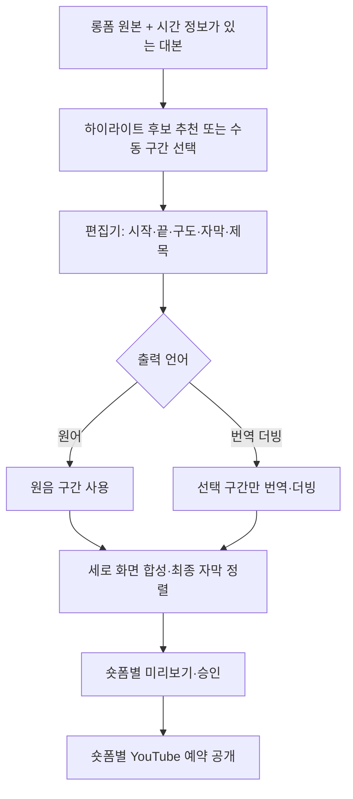

# 롱폼 → 숏폼 편집 설계

상태: 사용자가 2026-09-18에 추가한 기능 요구사항입니다. 현재는 설계와 구현 계획만 반영했으며 실행 코드는 없습니다. 숏폼 편집은 기본 제품 범위에 포함하고 립싱크는 선택 기능으로 유지합니다.

## 목표와 사용 흐름

원본 롱폼 하나에서 독립적으로 이해할 수 있는 하이라이트 여러 개를 만들고, 관리자가 구간·구도·자막을 편집해 각 숏폼을 검수·승인·예약 공개합니다.

완성된 롱폼 더빙 영상이 없어도 숏폼을 만들 수 있어야 합니다. 원본과 STT는 재사용하며 선택한 구간만 유료 더빙·선택적 립싱크를 수행합니다. 이미 만든 더빙본을 사용할 때는 원본과 최종 영상 사이의 시간 매핑이 유효한지 확인합니다.

## 첫 구현 범위

| 기능 | 동작 |
|---|---|
| 수동 구간 선택 | 원본 재생 화면과 대본에서 시작·끝 지정, 프레임 단위 미세 조정 |
| 후보 추천 | 대본을 바탕으로 후보 구간·제목·추천 이유 제안, 사람이 선택 |
| 여러 숏폼 | 하나의 원본에서 여러 편집 초안 생성, 초안마다 독립된 렌더·승인·예약 |
| 세로 화면 | 9:16, 1080×1920을 기본 제안으로 사용. 수동 크롭·위치 조정 또는 전체 화면을 유지하는 패딩 방식 |
| 자막 | STT 자막 교정, 문장·단어 강조, 글꼴·색·위치·줄바꿈 편집, 화면 안 배치 확인 |
| 제목 | 화면 제목과 게시 제목을 별도 편집, 원문에 없는 사실을 추천 제목에 추가하지 않도록 검수 |
| 오디오 | 원어 유지 또는 선택 구간 번역 더빙, 음량 조정, 배경음과 대사 중복 확인 |
| 미리보기 | 저해상도 초안과 최종 렌더 구분, 최종 파일을 재생한 뒤 승인 |
| 출력 | MP4 다운로드 또는 YouTube 업로드·예약, 편집본 자막의 SRT·WebVTT 내려받기 |

처음에는 숏폼 한 편을 원본의 연속된 구간 하나로 만듭니다. 여러 구간 이어 붙이기, 무음 자동 제거, 얼굴·화자 자동 추적 크롭, B-roll 자동 삽입은 후속 확장으로 둡니다. 수동 위치 보정과 패딩은 최초 버전에 포함합니다. 초기 목표 길이는 30~60초를 제안하되 편집자가 조정할 수 있습니다.

YouTube 공식 안내상 2024-10-15 이후 업로드된 정사각형 또는 세로 영상은 길이 3분 이하일 때 Shorts로 분류됩니다. 9:16과 30~60초는 제품 기본값 제안이지 플랫폼의 유일한 허용 형식이 아닙니다. 업로드 시 최신 규격과 채널 제약을 다시 확인하며 임의의 `isShort` API 필드를 가정하지 않습니다. 1분 초과 Shorts에 활성 Content ID 클레임이 있으면 차단될 수 있으므로 사용 음원을 검수합니다. [공식 Shorts 안내](https://support.google.com/youtube/answer/15424877?hl=en)

## 후보 추천

- 시간 정보가 있는 대본을 문맥이 이어지는 범위로 나누고 텍스트 분석용 LLM에 전달합니다. 공급자·모델은 아직 미정입니다.
- 출력은 원본 세그먼트 ID, 시작·끝, 제안 제목, 추천 이유로 제한하고 실제 원본 시간 범위인지 서버에서 검증합니다.
- 문장 중간 절단, 질문만 남고 답이 사라지는 구간, 맥락을 뒤집는 인용은 검수에서 표시합니다. 앞뒤 문맥도 편집기에 노출합니다.
- 유사하거나 크게 겹치는 후보를 정리하고 후보 수와 분석 비용을 제한합니다. 긴 대본은 구간별 후보를 모은 뒤 중복을 제거합니다.
- 추천 점수는 조회수 예측이나 성과 보장이 아닙니다. 추천 API가 실패해도 수동 편집은 사용할 수 있게 합니다.
- 추천 제목·대본은 데이터로 취급하고 실행 명령으로 사용하지 않습니다.

## 편집 데이터와 시간 처리

| 엔터티 | 내용 |
|---|---|
| clip_candidates | 원본·대본 버전, 추천 구간, 제목·이유, 공급자·모델, 선택 상태 |
| clip_edits | 원본 ID, 편집 버전, 출력 언어, 화면 크기, 자막 스타일, 화면 제목 |
| clip_ranges | 편집 버전, 원본 시작·끝, 출력 순서, 크롭 설정. 최초 버전은 구간 하나로 제한 |
| render_jobs | 편집 버전, 원본·대본·더빙 버전, 렌더 설정, 산출물 ID. 기존 jobs/stage_runs에 통합할지 구현 전 확정 |

원본 시각과 출력 시각을 구분합니다. 속도를 바꾸지 않는 단일 구간은 `출력 시각 = 원본 시각 - 선택 구간 시작`으로 매핑하고, 선택 범위와 교차하는 자막을 잘라 출력 구간으로 옮깁니다. 출력 시각이 음수가 되거나 영상 끝을 넘지 않게 합니다. 더빙·속도 조절이 있으면 최종 음성 타이밍에 맞춰 자막을 다시 정렬합니다.

구현한 자막 내보내기는 `GET /clips/{id}/subtitles?format=srt|vtt`입니다. 출력 시각(클립 시작이 0초)을 그대로 쓰고 화면 제목은 넣지 않습니다. 줄바꿈과 분할은 **그 편집본을 렌더할 때 쓴 표시 규칙**으로 계산하므로, 설정을 그 뒤에 바꿔도 영상과 같은 자막이 나옵니다(응답 헤더 `X-Subtitle-Rules`가 `rendered`). 규칙 기록이 없는 옛 편집본만 지금 설정을 쓰고 헤더가 `settings`입니다. 근거는 [기술 선택](TECH_DECISIONS.md)의 자막 파일 내보내기 항목에 있습니다.

자막 모양은 `subtitle_template`(내장 템플릿 이름)으로, 움직임은 `subtitle_animation`(비우면 템플릿 값, `none`이면 없음)으로, 동작을 겹쳐 만든 움직임 한 벌은 `subtitle_preset`(모션 프리셋 이름, 비우면 템플릿 값)으로 고릅니다. 자막을 어디서 끊을지는 `subtitle_pacing`(`broadcast`·`shortform`, 비우면 서버 설정)으로 고릅니다. `shortform`은 대본의 단어 시각에 맞춰 한 줄로 짧게 끊습니다. 목록은 `GET /subtitle-pacings`입니다. 프리셋을 주면 `subtitle_animation`보다 먼저 쓰입니다. 목록은 `GET /subtitle-presets`입니다. 자막의 `words`(정렬·전사가 준 단어 시각)는 노래방·단어별 등장 움직임이 쓰며, 대본 API가 돌려주는 값을 그대로 보내면 됩니다. 글자를 고친 자막은 `words`를 비웁니다. `stickers`(화살표·반짝이·말풍선·PNG)는 자막 위에 얹는 장식이며 항목은 [자막 파일·템플릿 도구](SUBTITLE_TOOL.md#스티커)에 있습니다. 템플릿은 굽는 자막의 글꼴·색·외곽선·위치·움직임만 정하고 줄바꿈·분할은 표시 규칙이 정합니다. 목록과 값은 [자막 파일·템플릿 도구](SUBTITLE_TOOL.md)에 있습니다.

편집 결정은 원본을 덮어쓰지 않는 데이터로 저장합니다. 렌더 입력 해시에 구간, 대본 버전, 크롭, 자막, 글꼴, 제목, 오디오, 출력 설정을 포함합니다. 설정이 달라지면 새 산출물 버전을 만들고 재승인합니다. 원본 삭제 정책에는 후보·편집·프리뷰·최종 숏폼의 파생 관계도 포함합니다.

FFmpeg의 trim/atrim, setpts/asetpts, crop, scale, pad, subtitles 등으로 합성하는 구성을 제안합니다. 정확한 컷 경계와 필터 적용이 필요하므로 단순 스트림 복사만으로 완성본을 만들지 않습니다. [FFmpeg 필터 문서](https://ffmpeg.org/ffmpeg-filters.html)

## 승인·게시

각 숏폼은 독립된 artifact·approval·publication을 사용합니다. 롱폼 승인은 숏폼 승인으로 상속하지 않습니다. 후보 선택이나 초안 저장은 공개 승인이 아닙니다. 승인한 최종 파일과 제목·설명·예약 설정을 고정하고 수정 시 재승인합니다. 여러 숏폼을 일괄 예약할 때도 선택한 버전과 게시 시각을 각 항목별로 확인합니다.

## 구현 순서와 완료 기준

1. **수동 편집:** 원본·STT 준비 후 구간 선택, 세로 크롭/패딩, 자막, 프리뷰와 최종 렌더를 구현합니다. 같은 원본에서 서로 다른 숏폼 두 개를 만들고 각각 수정해도 상대 결과가 바뀌지 않아야 합니다.
2. **추천:** LLM 후보와 대본 선택 UI를 연결합니다. 잘못된 시간 범위·중복 후보를 거부하고 공급자 실패 후에도 수동 편집이 가능해야 합니다.
3. **선택 구간 더빙:** 원어 출력을 먼저 완성한 뒤 번역·더빙 경로를 연결합니다. 전체 롱폼 더빙을 실행하지 않고 선택 구간의 음성만 생성하는지 확인합니다.
4. **검수·게시:** 공통 승인·YouTube 흐름과 연결합니다. 편집 후 과거 승인으로 게시되지 않고 여러 숏폼의 예약 상태가 독립적으로 추적되어야 합니다.

자동 검증은 실제 디코딩과 ffprobe로 컷 길이·해상도·트랙·타임스탬프를 확인하고 오디오 신호 분석으로 무음·누락을 검사합니다. ffprobe의 트랙 존재 확인만으로 발화 존재를 판정하지 않습니다. 자막 시간·화면 경계 검사에 더해 인물 잘림, 자막 가독성, 발언 맥락은 사람 검수를 수행합니다. 원본은 보존하고 재시도·중복 렌더·파일 정리도 검증합니다.
