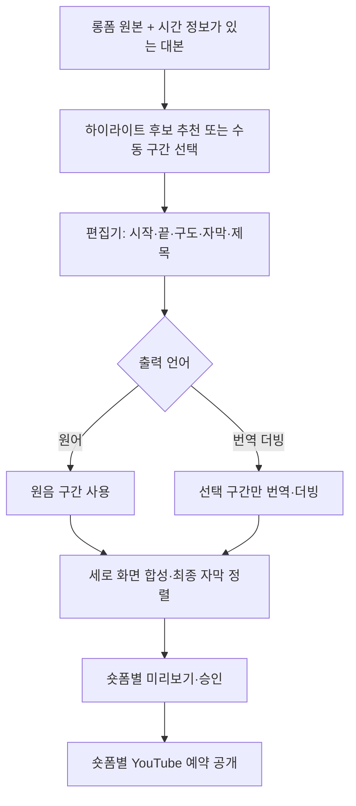

# 롱폼 → 숏폼 편집 설계

상태: 사용자가 2026-09-18에 추가한 기능 요구사항입니다. 현재는 설계와 구현 계획만 반영했으며 실행 코드는 없습니다. 숏폼 편집은 기본 제품 범위에 포함하고 립싱크는 선택 기능으로 유지합니다.

## 목표와 사용 흐름

원본 롱폼 하나에서 독립적으로 이해할 수 있는 하이라이트 여러 개를 만들고, 관리자가 구간·구도·자막을 편집해 각 숏폼을 검수·승인·예약 공개합니다.



완성된 롱폼 더빙 영상이 없어도 숏폼을 만들 수 있어야 합니다. 원본과 STT는 재사용하며 선택한 구간만 유료 더빙·선택적 립싱크를 수행합니다. 이미 만든 더빙본을 사용할 때는 원본과 최종 영상 사이의 시간 매핑이 유효한지 확인합니다.

## 첫 구현 범위

| 기능 | 동작 |
|---|---|
| 수동 구간 선택 | 원본 재생 화면과 대본에서 시작·끝 지정, 프레임 단위 미세 조정 |
| 후보 추천 | 대본을 바탕으로 후보 구간·제목·추천 이유 제안, 사람이 선택 |
| 여러 숏폼 | 하나의 원본에서 여러 편집 초안 생성, 초안마다 독립된 렌더·승인·예약 |
| 세로 화면 | 9:16, 1080×1920을 기본 제안으로 사용. 수동 크롭·위치 조정 또는 전체 화면을 유지하는 패딩 방식 |
| 자막 | STT 자막 교정, 문장·단어 강조, 글꼴·색·위치·줄바꿈 편집, 화면 안 배치 확인 |
| 제목 | 화면 제목과 게시 제목을 별도 편집, 원문에 없는 사실을 추천 제목에 추가하지 않도록 검수 |
| 오디오 | 원어 유지 또는 선택 구간 번역 더빙, 음량 조정, 배경음과 대사 중복 확인 |
| 미리보기 | 저해상도 초안과 최종 렌더 구분, 최종 파일을 재생한 뒤 승인 |
| 출력 | MP4 다운로드 또는 YouTube 업로드·예약, 편집본 자막의 SRT·WebVTT 내려받기 |

처음에는 숏폼 한 편을 원본의 연속된 구간 하나로 만듭니다. 여러 구간 이어 붙이기, 무음 자동 제거, 얼굴·화자 자동 추적 크롭, B-roll 자동 삽입은 후속 확장으로 둡니다. 수동 위치 보정과 패딩은 최초 버전에 포함합니다. 초기 목표 길이는 30~60초를 제안하되 편집자가 조정할 수 있습니다.

YouTube 공식 안내상 2024-10-15 이후 업로드된 정사각형 또는 세로 영상은 길이 3분 이하일 때 Shorts로 분류됩니다. 9:16과 30~60초는 제품 기본값 제안이지 플랫폼의 유일한 허용 형식이 아닙니다. 업로드 시 최신 규격과 채널 제약을 다시 확인하며 임의의 `isShort` API 필드를 가정하지 않습니다. 1분 초과 Shorts에 활성 Content ID 클레임이 있으면 차단될 수 있으므로 사용 음원을 검수합니다. [공식 Shorts 안내](https://support.google.com/youtube/answer/15424877?hl=en)

## 후보 추천

- 시간 정보가 있는 대본을 문맥이 이어지는 범위로 나누고 텍스트 분석용 LLM에 전달합니다. 공급자·모델은 아직 미정입니다.
- 출력은 원본 세그먼트 ID, 시작·끝, 제안 제목, 추천 이유로 제한하고 실제 원본 시간 범위인지 서버에서 검증합니다.
- 문장 중간 절단, 질문만 남고 답이 사라지는 구간, 맥락을 뒤집는 인용은 검수에서 표시합니다. 앞뒤 문맥도 편집기에 노출합니다.
- 유사하거나 크게 겹치는 후보를 정리하고 후보 수와 분석 비용을 제한합니다. 긴 대본은 구간별 후보를 모은 뒤 중복을 제거합니다.
- 추천 점수는 조회수 예측이나 성과 보장이 아닙니다. 추천 API가 실패해도 수동 편집은 사용할 수 있게 합니다.
- 추천 제목·대본은 데이터로 취급하고 실행 명령으로 사용하지 않습니다.

## 무음 자동 컷 (2026-09-21 추가)

말이 없는 구간을 빼고 남은 토막을 이어 붙입니다(Auto-Editor가 하는 일).
편집기의 **말 없는 구간 자동으로 잘라내기**를 켜면 씁니다(기본값 꺼짐).

**찾는 쪽은 이미 있었습니다** — `worker.analysis.speech_spans`(Silero VAD,
실패하면 FFmpeg `silencedetect`)를 자막 정렬에 쓰고 있었습니다. 없던 것은
자르는 쪽입니다.

| 값 | 기본 | 뜻 |
|---|---|---|
| `pad` | 0.12초 | 말 앞뒤로 남길 여유. 딱 붙여 자르면 첫 소리가 잘립니다. |
| `min_gap` | 0.6초 | 이보다 짧은 침묵은 자르지 않습니다(숨 쉬는 자리). |
| `min_keep` | 0.4초 | 이보다 짧은 토막은 버립니다. |

FFmpeg에서는 `select`/`aselect`로 남길 프레임만 통과시키고 `setpts`로 시각을
도로 0부터 세어 빈자리를 없앱니다. **자르고 나면 시간축이 달라지므로**
자막·단어 시각·스티커를 모두 옮깁니다(`pipeline/trimming.py`).

### 컷 목록을 손으로 고치기

자동으로 자르고 끝내면 결과를 렌더해 봐야 압니다. 그래서 **자르기 전에 재
봅니다**(무료 분석 작업 `silence`). 편집기에서 **말 없는 구간 자동으로
잘라내기**를 켜면 [무음 구간 미리 재기]가 나오고, 결과에서 [컷 불러오기]를
누르면 토막 목록이 체크박스로 펼쳐집니다.

- 몇 초 → 몇 초로 줄어드는지, 토막이 몇 개인지 먼저 보여 줍니다.
- 필요 없는 토막의 체크를 끄면 그 토막이 영상에서 빠집니다.
- 고친 목록은 `EditSpec.keep`으로 들어가고 **자동 탐지보다 우선합니다.**
  사람이 고른 것을 기계가 다시 덮지 않습니다.
- 목록을 비우면 다시 자동 탐지로 돌아갑니다.

LosslessCut의 컷 목록 편집에서 가져온 방식입니다(그 앱은 라이브러리가
아니므로 붙인 것이 아니라 같은 얼개만 따랐습니다).

### 이음매 전환

토막을 딱 붙이는 대신 겹쳐서 이을 수 있습니다(FFmpeg 내장 `xfade`,
소리는 `acrossfade`). 편집기의 **이음매 전환**에서 고릅니다(기본값은 딱
붙이기). 12종만 엽니다 — FFmpeg에는 50여 종이 있지만 화려한 것은 숏폼에서
산만합니다.

**전환을 넣으면 렌더가 두 번 돕니다.** `select`로 자르면 토막이 딱 붙어
전환을 끼울 자리가 없으므로, 1차에서 토막을 따로 떠(`trim`) 겹쳐 잇고
(`xfade`) 2차에서 기존 체인(크기·자막·스티커)을 씌웁니다. 한 그래프에
욱여넣으면 꼬리표가 얽혀 고치기 어려워집니다. 다시 인코딩하는 만큼 화질이
조금 깎이므로 중간 파일은 `crf 18`로 넉넉히 둡니다.

- 영상이 **(이음매 수 × 겹침)만큼 짧아집니다.** 자막·단어 시각·스티커·얼굴
  경로가 모두 그만큼 당겨집니다.
- 겹침은 **가장 짧은 토막의 절반**을 넘지 못합니다(`xfade`가 거부합니다).
  그래도 0.05초 미만이면 전환을 포기하고 딱 붙입니다.
- 무음 컷은 이음매가 잦아서 **딱 붙이는 쪽이 보통 자연스럽습니다.** 말이
  겹쳐 들리는 것을 피하려면 겹침을 짧게 두세요.
- GL Transitions는 GLSL 렌더 경로(직접 빌드한 외부 필터)가 필요해 쓰지
  않았습니다. 내장 `xfade`로 되는 것을 먼저 했습니다.

### 아는 한계

- 한 자막이 잘린 자리를 걸치면 남은 부분의 처음부터 끝까지로 둡니다. 자막을
  쪼개려면 글자도 쪼개야 하므로 그렇게 하지 않습니다.
- 단어 시각은 하나라도 잘려 나가면 **전부 버립니다.** 글자와 맞지 않는 단어
  시각은 노래방·단어별 등장을 어긋나게 합니다.
- 토막이 200개를 넘으면 가장 짧은 침묵부터 도로 붙입니다(필터 문자열 상한).
- 말을 하나도 못 찾으면 **자르지 않습니다.** 빈 영상을 내놓느니 그대로가
  낫습니다. 자르고 0.5초 미만이 남으면 거부합니다.
- 번역·더빙 경로에는 아직 없습니다. 더빙은 자막 조각이 곧 그 구간의 발화라
  시간축을 다시 잡으면 음성과 어긋납니다.
- `setpts=N/FRAME_RATE/TB`는 프레임률이 일정하다고 봅니다. 프레임률이 들쭉날쭉한
  원본에서는 음성과 어긋날 수 있습니다(아직 그런 원본으로 재지 않았습니다).

## 자동 리프레이밍 (2026-09-21 추가)

16:9를 9:16으로 자르면 가로의 절반 넘게 버립니다. 지금까지는 어디를 남길지
`focus_x`에 **고정 숫자 하나**로 정했고, 인물이 움직이면 화면 밖으로 나가도
그대로였습니다. 이제 얼굴을 따라 좌우 중심이 움직입니다(`pipeline/reframe.py`).
편집기의 **얼굴을 따라 화면 중심 움직이기**를 켜면 씁니다(기본값 꺼짐).

| 값 | 기본 | 뜻 |
|---|---|---|
| `deadzone` | 0.06 | 이보다 작게 움직이면 화면을 움직이지 않습니다(화면 폭 대비). |
| `max_speed` | 0.25 | 초당 따라갈 수 있는 최대 거리(화면 폭 대비). |

검출 결과를 그대로 따라가면 **화면이 덜덜 떱니다.** 얼굴 상자는 프레임마다
흔들리고 검출이 한 번 실패하면 중심이 튑니다. 그래서 작은 움직임은 무시하고,
움직일 때도 속도를 제한하며, 얼굴을 못 찾은 구간은 마지막 위치를 유지합니다.

FFmpeg에서는 `crop`의 x를 시간의 식(구간마다 직선)으로 넘깁니다. **무음 컷과
같은 시간축을 씁니다** — `crop`은 자르기(`select`) 뒤에 오므로 얼굴 시각도
잘린 뒤의 시각으로 옮깁니다.

### 검출기 — 모델 파일이 있어야 합니다

**MediaPipe 1.0에는 얼굴 모델이 들어 있지 않습니다.** 모델을 품고 있던 옛
`mediapipe.solutions` API는 사라졌고, 지금의 Tasks API는 `.tflite`를 따로 받아
경로를 넘겨야 합니다.

```bash
python3 scripts/fetch_face_model.py --out .models   # 230KB, 고정 URL·SHA-256
# 워커에 R4_FACE_MODEL=<받은 경로>
```

워커 이미지에는 `libegl1`·`libgles2`도 필요합니다(MediaPipe가 공유 라이브러리를
열 때 씁니다). `infra/Dockerfile.worker`에 들어 있습니다.

모델이 없으면 OpenCV 검출기로 내려갑니다. 다만 `scenedetect`가 끌고 오는 것은
**opencv-headless**라 haarcascade XML이 없을 수 있고, 그러면 **쓸 수 있는
검출기가 없습니다.** 그때는 `face_track()`이 `"none"`을 돌려주고 리프레이밍은
`focus_x` 고정으로 돌아갑니다(지금까지와 같은 동작).

어느 쪽을 썼는지는 `face_track()`이 이름으로 함께 돌려줍니다 — `mediapipe`,
`opencv-haar`, `none`. **조용히 품질이 달라지지 않게 하려는 것입니다.**

### 아는 한계

- 사람이 여럿이면 **가장 큰 얼굴**만 따라갑니다. 누가 말하는지는 모릅니다.
- **세로(y)는 건드리지 않습니다.** 16:9 → 9:16에서는 세로가 거의 그대로라
  얻는 것이 적고, 위아래로 흔들리면 더 눈에 띕니다.
- `mode="crop"`에서만 씁니다. `pad`는 화면 전체를 남깁니다.
- 얼굴을 한 번도 못 찾으면 `focus_x` 고정으로 돌아갑니다.
- 꼭짓점은 40개까지입니다(FFmpeg 식 길이 상한). 넘으면 솎아 냅니다.

## 음성 잡음 제거 (2026-09-21 추가)

FFmpeg 내장 `afftdn`입니다. **새 의존성이 없습니다.** 편집기의 **음성 잡음
제거**에서 약하게(`nf=-20`)·강하게(`nf=-35`)를 고릅니다. 강하게는 잡음을 더
깎지만 목소리도 같이 깎일 수 있습니다. 세기 값은 잰 것이 아니라 정한
것입니다.

무음 컷과 함께 쓰면 **자르기가 먼저입니다.** 버릴 구간까지 잡음을 깎는 것은
헛일이고, 잡음 제거가 이어 붙인 자리의 이음매를 뭉개는 편이 낫습니다.

DeepFilterNet 같은 학습 모델이 더 잘 깎지만 파이토치 계열이라 워커 이미지가
크게 늘어납니다. 먼저 내장 필터로 재 보고 모자라면 그때 붙이는 순서입니다.

## 숏폼 구간 추천 (2026-09-21 추가)

PySceneDetect는 이미 붙어 있었지만 **장면 경계를 내놓는 데서 끝났습니다.**
이제 그 경계와 발화 구간을 합쳐 점수를 매깁니다(`pipeline/highlights.py`).
편집기의 **숏폼 구간 추천**을 누르면 무료 분석 작업(`highlights`)이 돌고,
결과가 버튼으로 나옵니다. 누르면 그 구간이 잡힙니다.

| 신호 | 비중 | 왜 |
|---|---|---|
| 말이 차 있는 비율 | 0.60 | 숏폼은 말이 끊기면 바로 넘깁니다. |
| 장면 전환 빈도 | 0.25 | 화면이 바뀌면 덜 지루합니다(1분에 6회까지 쳐줍니다). |
| 영상에서의 자리 | 0.15 | 맨 앞(인사)·맨 뒤(마무리)는 대체로 알맹이가 아닙니다. |

후보는 **장면 경계에서 시작하고 끝납니다.** 길이가 목표(기본 45초)에
가까울수록 점수가 높고, 겹치는 후보는 높은 쪽만 남깁니다.

**비중은 잰 값이 아니라 정한 값입니다.** 조회수로 검증한 적이 없습니다.
순위를 매기는 데 쓰는 것이지 "이 구간이 좋다"는 근거가 아닙니다. 말이 35%도
차 있지 않은 구간은 후보로 보지 않으므로 음악·풍경 영상에서는 아무것도
추천하지 않습니다.

기존 **구간 후보 찾기**(`/suggestions`)와는 다릅니다. 그쪽은 저장된 대본의
문장 경계만 봅니다. 이쪽은 화면과 소리를 봅니다.

## 편집 데이터와 시간 처리

| 엔터티 | 내용 |
|---|---|
| clip_candidates | 원본·대본 버전, 추천 구간, 제목·이유, 공급자·모델, 선택 상태 |
| clip_edits | 원본 ID, 편집 버전, 출력 언어, 화면 크기, 자막 스타일, 화면 제목 |
| clip_ranges | 편집 버전, 원본 시작·끝, 출력 순서, 크롭 설정. 최초 버전은 구간 하나로 제한 |
| render_jobs | 편집 버전, 원본·대본·더빙 버전, 렌더 설정, 산출물 ID. 기존 jobs/stage_runs에 통합할지 구현 전 확정 |

원본 시각과 출력 시각을 구분합니다. 속도를 바꾸지 않는 단일 구간은 `출력 시각 = 원본 시각 - 선택 구간 시작`으로 매핑하고, 선택 범위와 교차하는 자막을 잘라 출력 구간으로 옮깁니다. 출력 시각이 음수가 되거나 영상 끝을 넘지 않게 합니다. 더빙·속도 조절이 있으면 최종 음성 타이밍에 맞춰 자막을 다시 정렬합니다.

구현한 자막 내보내기는 `GET /clips/{id}/subtitles?format=srt|vtt`입니다. 출력 시각(클립 시작이 0초)을 그대로 쓰고 화면 제목은 넣지 않습니다. 줄바꿈과 분할은 **그 편집본을 렌더할 때 쓴 표시 규칙**으로 계산하므로, 설정을 그 뒤에 바꿔도 영상과 같은 자막이 나옵니다(응답 헤더 `X-Subtitle-Rules`가 `rendered`). 규칙 기록이 없는 옛 편집본만 지금 설정을 쓰고 헤더가 `settings`입니다. 근거는 [기술 선택](TECH_DECISIONS.md)의 자막 파일 내보내기 항목에 있습니다.

자막 모양은 `subtitle_template`(내장 템플릿 이름)으로, 움직임은 `subtitle_animation`(비우면 템플릿 값, `none`이면 없음)으로, 동작을 겹쳐 만든 움직임 한 벌은 `subtitle_preset`(모션 프리셋 이름, 비우면 템플릿 값)으로 고릅니다. 자막을 어디서 끊을지는 `subtitle_pacing`(`broadcast`·`shortform`, 비우면 서버 설정)으로 고릅니다. `shortform`은 대본의 단어 시각에 맞춰 한 줄로 짧게 끊습니다. 목록은 `GET /subtitle-pacings`입니다. 프리셋을 주면 `subtitle_animation`보다 먼저 쓰입니다. 목록은 `GET /subtitle-presets`입니다. 자막의 `words`(정렬·전사가 준 단어 시각)는 노래방·단어별 등장 움직임이 쓰며, 대본 API가 돌려주는 값을 그대로 보내면 됩니다. 글자를 고친 자막은 `words`를 비웁니다. `stickers`(화살표·반짝이·말풍선·PNG)는 자막 위에 얹는 장식이며 항목은 [자막 파일·템플릿 도구](SUBTITLE_TOOL.md#스티커)에 있습니다. 템플릿은 굽는 자막의 글꼴·색·외곽선·위치·움직임만 정하고 줄바꿈·분할은 표시 규칙이 정합니다. 목록과 값은 [자막 파일·템플릿 도구](SUBTITLE_TOOL.md)에 있습니다.

편집 결정은 원본을 덮어쓰지 않는 데이터로 저장합니다. 렌더 입력 해시에 구간, 대본 버전, 크롭, 자막, 글꼴, 제목, 오디오, 출력 설정을 포함합니다. 설정이 달라지면 새 산출물 버전을 만들고 재승인합니다. 원본 삭제 정책에는 후보·편집·프리뷰·최종 숏폼의 파생 관계도 포함합니다.

FFmpeg의 trim/atrim, setpts/asetpts, crop, scale, pad, subtitles 등으로 합성하는 구성을 제안합니다. 정확한 컷 경계와 필터 적용이 필요하므로 단순 스트림 복사만으로 완성본을 만들지 않습니다. [FFmpeg 필터 문서](https://ffmpeg.org/ffmpeg-filters.html)

## 승인·게시

각 숏폼은 독립된 artifact·approval·publication을 사용합니다. 롱폼 승인은 숏폼 승인으로 상속하지 않습니다. 후보 선택이나 초안 저장은 공개 승인이 아닙니다. 승인한 최종 파일과 제목·설명·예약 설정을 고정하고 수정 시 재승인합니다. 여러 숏폼을 일괄 예약할 때도 선택한 버전과 게시 시각을 각 항목별로 확인합니다.

## 구현 순서와 완료 기준

1. **수동 편집:** 원본·STT 준비 후 구간 선택, 세로 크롭/패딩, 자막, 프리뷰와 최종 렌더를 구현합니다. 같은 원본에서 서로 다른 숏폼 두 개를 만들고 각각 수정해도 상대 결과가 바뀌지 않아야 합니다.
2. **추천:** LLM 후보와 대본 선택 UI를 연결합니다. 잘못된 시간 범위·중복 후보를 거부하고 공급자 실패 후에도 수동 편집이 가능해야 합니다.
3. **선택 구간 더빙:** 원어 출력을 먼저 완성한 뒤 번역·더빙 경로를 연결합니다. 전체 롱폼 더빙을 실행하지 않고 선택 구간의 음성만 생성하는지 확인합니다.
4. **검수·게시:** 공통 승인·YouTube 흐름과 연결합니다. 편집 후 과거 승인으로 게시되지 않고 여러 숏폼의 예약 상태가 독립적으로 추적되어야 합니다.

자동 검증은 실제 디코딩과 ffprobe로 컷 길이·해상도·트랙·타임스탬프를 확인하고 오디오 신호 분석으로 무음·누락을 검사합니다. ffprobe의 트랙 존재 확인만으로 발화 존재를 판정하지 않습니다. 자막 시간·화면 경계 검사에 더해 인물 잘림, 자막 가독성, 발언 맥락은 사람 검수를 수행합니다. 원본은 보존하고 재시도·중복 렌더·파일 정리도 검증합니다.
